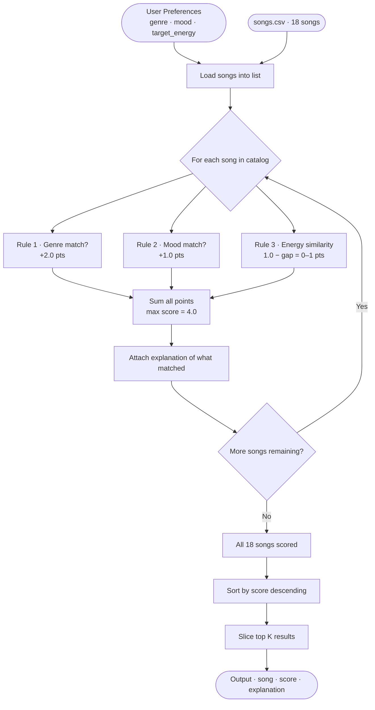
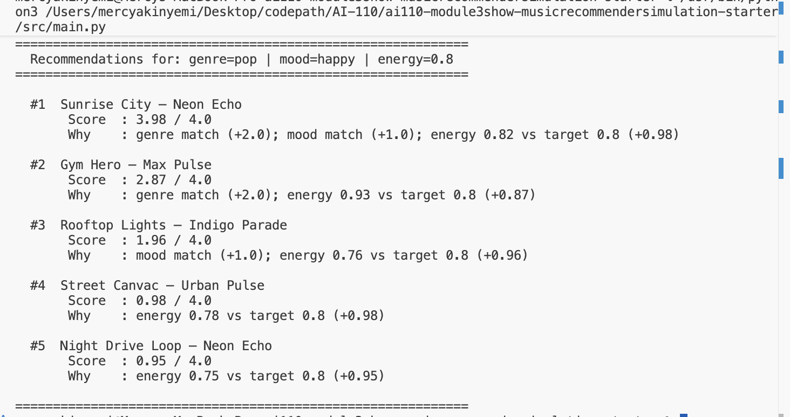

# 🎵 Music Recommender Simulation

## Project Summary

In this project you will build and explain a small music recommender system.

Your goal is to:

- Represent songs and a user "taste profile" as data
- Design a scoring rule that turns that data into recommendations
- Evaluate what your system gets right and wrong
- Reflect on how this mirrors real world AI recommenders

This simulation builds a content-based music recommender that scores songs against a user's taste profile using weighted feature matching. It loads a small catalog from `data/songs.csv`, computes a similarity score for each song, and returns the top-ranked matches with a plain-language explanation of why each song was recommended.

---

## How The System Works

Real-world recommenders like Spotify and YouTube Music typically combine two strategies: **collaborative filtering**, which surfaces songs that users with similar taste have enjoyed, and **content-based filtering**, which matches songs based on their intrinsic audio and metadata attributes. This simulation focuses entirely on content-based filtering — it never looks at what other users listened to. Instead, it compares each song's measurable features directly against a user's stated preferences and computes a point-based similarity score. The priority is transparency and interpretability: every recommendation comes with a plain-language reason so it is clear exactly why a song was suggested, which is something real production systems rarely surface.

---

### Song Features

Each `Song` object stores the following attributes drawn from `data/songs.csv`:

| Feature | Type | Description |
|---|---|---|
| `id` | int | Unique identifier |
| `title` | str | Song title |
| `artist` | str | Artist name |
| `genre` | str | Style category — e.g. `pop`, `lofi`, `rock`, `ambient`, `jazz`, `synthwave`, `indie pop` |
| `mood` | str | Emotional quality — e.g. `happy`, `chill`, `intense`, `relaxed`, `focused`, `moody` |
| `energy` | float (0–1) | Activation level from very calm to very intense |
| `tempo_bpm` | float | Beats per minute — physical pace of the track |
| `valence` | float (0–1) | Musical positivity — low is dark/somber, high is bright/upbeat |
| `danceability` | float (0–1) | How strongly the track drives rhythmic movement |
| `acousticness` | float (0–1) | Degree of organic/acoustic vs. electronic/produced texture |

---

### UserProfile Features

Each `UserProfile` stores the user's taste preferences that the scorer compares against:

| Field | Type | Description |
|---|---|---|
| `favorite_genre` | str | The genre the user most wants to hear — matched exactly against `Song.genre` |
| `favorite_mood` | str | The emotional feel the user is after — matched exactly against `Song.mood` |
| `target_energy` | float (0–1) | The user's ideal activation level — scored by proximity to `Song.energy` |
| `likes_acoustic` | bool | Whether the user prefers acoustic texture — influences `Song.acousticness` weight |

---

### Algorithm Recipe

Data flows through three sequential phases:

```
Input (User Prefs + songs.csv)
  → Process (score every song in the catalog)
    → Output (sort and return top K with explanations)
```

**Phase 1 — Load**
Read `data/songs.csv` into a list of song dictionaries. Every song enters the scoring phase — no pre-filtering.

**Phase 2 — Score** *(runs once per song, 18 times total)*

Each song is judged by three rules and assigned a point total:

| Rule | Points | Logic |
|---|---|---|
| Genre match | **+2.0** | Exact string match against `favorite_genre`. Heaviest weight because genre defines the entire sonic space — wrong genre is a near-total mismatch. |
| Mood match | **+1.0** | Exact string match against `favorite_mood`. Strong signal but weighted lower than genre because mood shifts more with context. |
| Energy similarity | **+0.0 to +1.0** | `1.0 − \|song.energy − target_energy\|` — rewards closeness, not magnitude. A song at 0.40 scores 0.98 for a user targeting 0.38; a song at 0.91 scores only 0.47. |

**Maximum possible score: 4.0**

**Phase 3 — Rank**
All 18 scored songs are sorted by score descending. The top `k` results are returned as `(song, score, explanation)` tuples, where the explanation lists exactly which rules fired and how many points each contributed.

**Flowchart**



---

### Known Biases and Limitations

**Genre over-prioritization.** Genre carries +2.0 of a possible 4.0 points — 50% of the maximum score. A song that perfectly matches the user's mood and energy but belongs to a different genre will rarely surface above a genre-matched song with a weaker mood and energy fit. This means a great blues track could be invisible to a user whose profile says `"jazz"`, even though the listening experience would be nearly identical.

**Binary categorical penalty.** Genre and mood are scored as exact matches only — there is no partial credit. A `"rock"` user receives zero genre points for a `"metal"` song, despite the two being acoustically close neighbors. This creates an artificial hard boundary between adjacent styles.

**Energy as the only numerical feature.** Valence, tempo, danceability, and acousticness are stored on every song but are not used in the scoring formula. Two songs with the same genre, mood, and energy but opposite emotional brightness (one euphoric, one dark) will receive identical scores.

**Small catalog amplifies all of the above.** With only 18 songs, a user whose preferred genre appears in fewer than three songs will see a steep quality cliff between the top result and the remaining recommendations.

---

## Sample Output
The following shows the top 5 recommendations for the `pop/happy` profile
(genre=pop, mood=happy, target_energy=0.80):




---

## Getting Started

### Setup

1. Create a virtual environment (optional but recommended):

   ```bash
   python -m venv .venv
   source .venv/bin/activate      # Mac or Linux
   .venv\Scripts\activate         # Windows

2. Install dependencies

```bash
pip install -r requirements.txt
```

3. Run the app:

```bash
python -m src.main
```

### Running Tests

Run the starter tests with:

```bash
pytest
```

You can add more tests in `tests/test_recommender.py`.

---

## Experiments You Tried

Use this section to document the experiments you ran. For example:

- What happened when you changed the weight on genre from 2.0 to 0.5
- What happened when you added tempo or valence to the score
- How did your system behave for different types of users

---

## Limitations and Risks

Summarize some limitations of your recommender.

Examples:

- It only works on a tiny catalog
- It does not understand lyrics or language
- It might over favor one genre or mood

You will go deeper on this in your model card.

---

## Reflection

Read and complete `model_card.md`:

[**Model Card**](model_card.md)

Write 1 to 2 paragraphs here about what you learned:

- about how recommenders turn data into predictions
- about where bias or unfairness could show up in systems like this


---

## 7. `model_card_template.md`

Combines reflection and model card framing from the Module 3 guidance. :contentReference[oaicite:2]{index=2}  

```markdown
# 🎧 Model Card - Music Recommender Simulation

## 1. Model Name

Give your recommender a name, for example:

> VibeFinder 1.0

---

## 2. Intended Use

- What is this system trying to do
- Who is it for

Example:

> This model suggests 3 to 5 songs from a small catalog based on a user's preferred genre, mood, and energy level. It is for classroom exploration only, not for real users.

---

## 3. How It Works (Short Explanation)

Describe your scoring logic in plain language.

- What features of each song does it consider
- What information about the user does it use
- How does it turn those into a number

Try to avoid code in this section, treat it like an explanation to a non programmer.

---

## 4. Data

Describe your dataset.

- How many songs are in `data/songs.csv`
- Did you add or remove any songs
- What kinds of genres or moods are represented
- Whose taste does this data mostly reflect

---

## 5. Strengths

Where does your recommender work well

You can think about:
- Situations where the top results "felt right"
- Particular user profiles it served well
- Simplicity or transparency benefits

---

## 6. Limitations and Bias

Where does your recommender struggle

Some prompts:
- Does it ignore some genres or moods
- Does it treat all users as if they have the same taste shape
- Is it biased toward high energy or one genre by default
- How could this be unfair if used in a real product

---

## 7. Evaluation

How did you check your system

Examples:
- You tried multiple user profiles and wrote down whether the results matched your expectations
- You compared your simulation to what a real app like Spotify or YouTube tends to recommend
- You wrote tests for your scoring logic

You do not need a numeric metric, but if you used one, explain what it measures.

---

## 8. Future Work

If you had more time, how would you improve this recommender

Examples:

- Add support for multiple users and "group vibe" recommendations
- Balance diversity of songs instead of always picking the closest match
- Use more features, like tempo ranges or lyric themes

---

## 9. Personal Reflection

A few sentences about what you learned:

- What surprised you about how your system behaved
- How did building this change how you think about real music recommenders
- Where do you think human judgment still matters, even if the model seems "smart"

